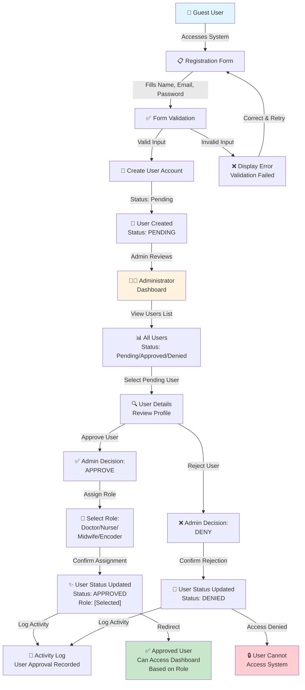
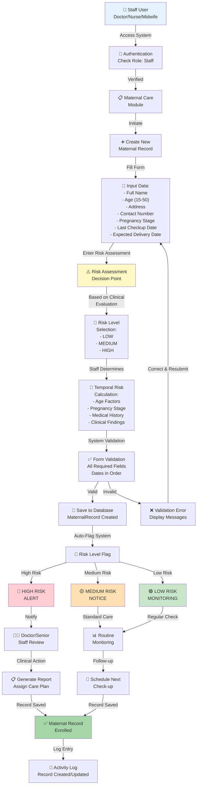
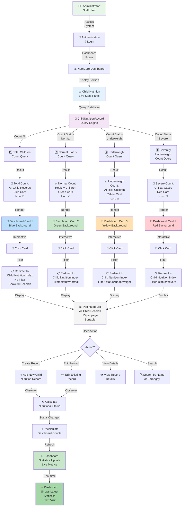
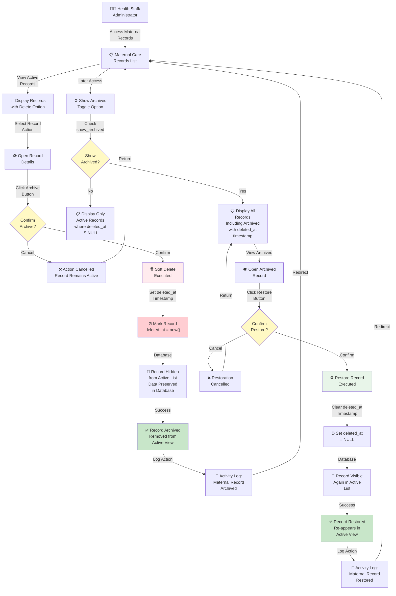

# NutriCare Activity Diagrams

## Introduction

The NutriCare Rural Health Unit (RHU) system is a comprehensive health monitoring platform designed to support maternal and child health initiatives. The system currently has five (5) distinct user roles that interact with the platform in coordinated workflows: **Administrator**, **Doctor**, **Nurse**, **Midwife**, and **Data Encoder**. The following figures illustrate the activity diagrams that demonstrate how these users interact with the system during critical health monitoring functionalities, including user authentication and role-based approval, maternal risk assessment enrollment, and child nutritional tracking with automated status calculations. These workflows ensure that health data is properly validated, systematically processed, and appropriately alerted to responsible personnel for timely clinical intervention.

---

## Activity Diagram 1: User Authentication & Role-Based Approval

This diagram illustrates the complete workflow from user registration through administrative approval and role assignment. The process ensures that only authorized health workers can access the system after verification by the Administrator.



**Flow Description:**
1. **Registration Phase:** Guest users access the registration form and create an account with name, email, and password
2. **Validation Phase:** System validates input data for completeness and uniqueness
3. **Pending Status:** New users are created with "Pending" status awaiting administrative review
4. **Admin Review:** Administrator reviews all pending users in the dashboard
5. **Approval Decision:** Admin can either approve and assign a role, or deny the user
6. **Role Assignment:** Upon approval, a specific role (Doctor, Nurse, Midwife, or Encoder) is assigned
7. **Access Grant/Deny:** Approved users gain system access; denied users cannot access the system
8. **Activity Logging:** All approval/denial actions are recorded in activity logs for audit trails

---

## Activity Diagram 2: Maternal Health Enrollment & Risk Calculation

This diagram demonstrates the maternal health enrollment process where health workers (Doctor, Nurse, or Midwife) input patient data, and the system processes risk assessment information. Health workers manually determine and input risk levels based on clinical assessment.



**Flow Description:**
1. **Staff Access:** Doctor, Nurse, or Midwife logs in and accesses the Maternal Care module
2. **Data Collection:** Staff enters comprehensive patient information including demographics, pregnancy details, and checkup information
3. **Risk Assessment:** Staff performs clinical evaluation and assigns risk level (Low/Medium/High) based on:
   - Maternal age
   - Pregnancy trimester stage
   - Days since last checkup
   - Clinical findings and medical history
4. **Temporal Calculation:** System uses entered dates and pregnancy stage to calculate time-based risk factors
5. **Validation:** System validates all data for completeness and logical consistency
6. **Database Storage:** Valid records are saved to the database
7. **Automatic Flagging:** System automatically categorizes records by risk level
8. **Alert Generation:** High-risk cases trigger clinical alerts for immediate review by senior staff
9. **Care Planning:** Appropriate follow-up and monitoring schedules are generated based on risk level
10. **Audit Trail:** All data entries and updates are logged for compliance and quality assurance

---

## Activity Diagram 3: Child Nutrition Tracking & Automated Status Calculation

This diagram shows the child nutrition monitoring workflow where health staff and data encoders input anthropometric measurements, and the system automatically calculates nutritional status using WHO Z-Score standards, generating alerts as needed.

```mermaid
graph TD
    A["👨‍⚕️ Health Staff/<br/>Data Encoder"] -->|Access System| B["🔐 Authentication<br/>Check Role: Staff/Encoder"]
    B -->|Verified| C["📋 Child Nutrition<br/>Module"]
    C -->|Initiate| D["➕ Create New<br/>Child Record"]
    
    D -->|Fill Form| E["📝 Input Child Data:<br/>- Full Name<br/>- Age (Months: 0-180)<br/>- Barangay<br/>- Weight (kg)<br/>- Height (cm)<br/>- Last Weigh-in Date"]
    
    E -->|Submit Data| F["✅ Form Validation<br/>Check:"]
    F -->|- Date Format<br/>- Numeric Values<br/>- Range Checks| G{Valid?}
    
    G -->|Invalid| H["❌ Validation Error<br/>Display Messages"]
    H -->|Correct & Resubmit| E
    
    G -->|Valid| I["👶 Patient Linking<br/>Check if Patient<br/>Exists"]
    I -->|New Child| J["👨‍👩‍👧 Create Patient<br/>Record<br/>Category: CHILD"]
    I -->|Existing Child| K["🔗 Link to<br/>Existing Patient<br/>Record"]
    
    J -->|Created| L["💾 Save Child<br/>Nutrition Record"]
    K -->|Linked| L
    
    L -->|Trigger Observer| M["⚙️ System Processes<br/>Automatic Calculation"]
    
    M -->|Calculate BMI| N["📐 BMI Formula:<br/>BMI = Weight(kg) /<br/>[Height(m)]²"]
    
    N -->|Get Age Reference| O["📊 WHO Reference<br/>Data by Age:<br/>- Mean BMI<br/>- Std Deviation<br/>for Age Group"]
    
    O -->|Calculate Z-Score| P["🔢 Z-Score Formula:<br/>Z = (BMI - Mean) /<br/>Std Dev"]
    
    P -->|Classify Status| Q["📈 Nutritional Status<br/>Classification:<br/>Decision Point"]
    
    Q -->|Z-Score < -3| R["🔴 SEVERELY<br/>UNDERWEIGHT"]
    Q -->|Z-Score -3 to -2| S["🟡 UNDERWEIGHT"]
    Q -->|Z-Score > -2| T["🟢 NORMAL<br/>NUTRITION"]
    
    R -->|Alert Generated| U["🚨 CRITICAL ALERT<br/>Severe Malnutrition<br/>Immediate Intervention"]
    S -->|Alert Generated| V["⚠️ WARNING ALERT<br/>Nutritional Risk<br/>Monitoring Plan"]
    T -->|Status Recorded| W["✅ NORMAL STATUS<br/>Routine Monitoring"]
    
    U -->|Notify| X["👨‍⚕️ Doctor/Nurse<br/>Review & Plan"]
    V -->|Notify| X
    W -->|Record Status| Y["📋 Display Record<br/>in System"]
    
    X -->|Clinical Action| Z["📅 Schedule<br/>Follow-up Visit<br/>Generate Report"]
    Z -->|Save Result| Y
    
    Y -->|All Data| AA["✅ Child Nutrition<br/>Record Complete:<br/>Status: Stored<br/>Alerts: Generated"]
    
    AA -->|Log Entry| AB["📝 Activity Log<br/>Record Created<br/>Alerts Triggered"]
    
    style A fill:#e0f2f1
    style M fill:#f3e5f5
    style U fill:#ffcdd2
    style V fill:#ffe0b2
    style T fill:#c8e6c9
    style AA fill:#a5d6a7
```



**Flow Description:**
1. **User Access:** Health staff or data encoder logs in and accesses the Child Nutrition module
2. **Data Entry:** Staff inputs child demographic and anthropometric measurements:
   - Full name
   - Age in months (0-180 months / 0-5+ years)
   - Barangay/location
   - Weight in kilograms
   - Height in centimeters
   - Date of last measurement
3. **Input Validation:** System validates all inputs for format, type, and logical range checks
4. **Patient Management:** System automatically:
   - Creates new patient record if child doesn't exist
   - Links nutrition data to existing patient record if found
5. **Automatic Calculation Trigger:** Upon saving, system's Observer pattern automatically initiates calculations
6. **BMI Calculation:** System computes Body Mass Index using standard formula
7. **WHO Reference Data:** System retrieves age-appropriate WHO reference values for BMI standards
8. **Z-Score Calculation:** System calculates Z-Score to compare child's measurements against age-specific standards
9. **Status Classification:** Based on Z-Score thresholds:
   - **Z < -3:** Severely Underweight (Critical - Immediate Action)
   - **Z -3 to -2:** Underweight (Warning - Monitoring Required)
   - **Z > -2:** Normal (Routine Monitoring)
10. **Alert Generation:** System automatically generates appropriate alert levels for clinical attention
11. **Clinical Action:** Medical staff review alerts and create follow-up care plans
12. **Record Storage:** Complete record with calculated status and alerts is stored in database
13. **Audit Trail:** All data entry, calculation, and alert generation is logged for quality assurance

---

## Activity Diagram 4: Patient Management & Automatic Linking

This diagram illustrates how the system automatically creates and links patient records when enrolling maternal or child nutrition cases, ensuring data synchronization across both modules.

```mermaid
graph TD
    A["👤 Health Staff<br/>Doctor/Nurse/Midwife/<br/>Data Encoder"] -->|Access Patient<br/>Enrollment Form| B["📋 Patient<br/>Enrollment Form"]
    
    B -->|Select Type| C{Enrollment<br/>Type?}
    
    C -->|Maternal| D["🤰 Maternal<br/>Enrollment"]
    C -->|Child| E["👶 Child Nutrition<br/>Enrollment"]
    
    D -->|Enter Data:<br/>- Name<br/>- Age<br/>- Address<br/>- Contact<br/>- Pregnancy Stage<br/>- Checkup Dates| F["📝 Maternal<br/>Form Data"]
    
    E -->|Enter Data:<br/>- Name<br/>- Age (months)<br/>- Barangay<br/>- Weight/Height<br/>- Weigh-in Date| G["📝 Child<br/>Form Data"]
    
    F -->|Submit| H["✅ Form Validation<br/>Maternal Data"]
    G -->|Submit| I["✅ Form Validation<br/>Child Data"]
    
    H -->|Valid| J["🔍 Check if Patient<br/>Exists by Name +<br/>Barangay"]
    I -->|Valid| K["🔍 Check if Patient<br/>Exists by Name +<br/>Barangay"]
    
    H -->|Invalid| L["❌ Validation Error<br/>Display Messages"]
    I -->|Invalid| M["❌ Validation Error<br/>Display Messages"]
    
    L -->|Correct| F
    M -->|Correct| G
    
    J -->|Patient<br/>Exists| N["🔗 Link to Existing<br/>Patient Record"]
    J -->|New Patient| O["➕ Create New<br/>Patient Record<br/>Category: PREGNANT"]
    
    K -->|Patient<br/>Exists| P["🔗 Link to Existing<br/>Patient Record"]
    K -->|New Patient| Q["➕ Create New<br/>Patient Record<br/>Category: CHILD"]
    
    O -->|Created| R["💾 Create Maternal<br/>Record with<br/>patient_id Link"]
    N -->|Linked| R
    
    Q -->|Created| S["💾 Create Child<br/>Nutrition Record<br/>with patient_id Link"]
    P -->|Linked| S
    
    R -->|Observer Triggered| T["⚙️ Auto-Calculate<br/>Risk Level"]
    S -->|Observer Triggered| U["⚙️ Auto-Calculate<br/>Nutritional Status<br/>Z-Score"]
    
    T -->|Result| V["✅ Maternal Record<br/>Saved with Risk Level"]
    U -->|Result| W["✅ Child Nutrition<br/>Record Saved with<br/>Status"]
    
    V -->|Both Tables<br/>Updated| X["📊 Data Synchronized:<br/>Patients + Maternal<br/>Patients + Child Nutrition"]
    W -->|Both Tables<br/>Updated| X
    
    X -->|Log Activity| Y["📝 Activity Log<br/>Record Created/<br/>Patient Linked"]
    
    Y -->|Success| Z["✅ Enrollment<br/>Complete<br/>Redirect to List"]
    
    style A fill:#e8f5e9
    style C fill:#fff9c4
    style O fill:#e3f2fd
    style Q fill:#e0f2f1
    style T fill:#f3e5f5
    style U fill:#fce4ec
    style X fill:#c8e6c9
    style Z fill:#a5d6a7
```

**Flow Description:**
1. **Enrollment Type Selection:** Staff chooses between maternal or child nutrition enrollment
2. **Data Entry:** Staff inputs all required demographic and health data
3. **Validation:** System validates all inputs for completeness and format
4. **Patient Lookup:** System checks if patient already exists by name and barangay
5. **Patient Creation/Linking:** 
   - If patient doesn't exist, new record is created with appropriate category (PREGNANT or CHILD)
   - If patient exists, new health record is linked to existing patient
6. **Automatic Calculation:** System observers automatically calculate health metrics:
   - Maternal: Risk level based on age and pregnancy factors
   - Child: Nutritional status using WHO Z-Score standards
7. **Data Synchronization:** Both patient and health records are saved simultaneously, maintaining referential integrity
8. **Activity Logging:** All enrollment actions are recorded for audit trails

---

## Activity Diagram 5: Report Generation & PDF Export

This diagram demonstrates how users can generate professional PDF reports from maternal and child nutrition records for clinical documentation and patient communication.

```mermaid
graph TD
    A["👨‍⚕️ Health Staff/<br/>Admin/Doctor"] -->|View Patient<br/>Records| B["📋 Records List<br/>Maternal Care or<br/>Child Nutrition"]
    
    B -->|Select Record| C["👁️ View Record<br/>Details Page"]
    
    C -->|Click Generate<br/>Report Button| D{Report<br/>Type?}
    
    D -->|Maternal Care| E["🤰 Maternal<br/>Record Data"]
    D -->|Child Nutrition| F["👶 Child Nutrition<br/>Record Data"]
    
    E -->|Retrieve from<br/>Database| G["📊 Maternal Record<br/>Information:<br/>- Full Name<br/>- Age<br/>- Risk Level<br/>- Pregnancy Stage<br/>- Checkup Dates<br/>- EDD"]
    
    F -->|Retrieve from<br/>Database| H["📊 Child Record<br/>Information:<br/>- Full Name<br/>- Age (months)<br/>- Weight/Height<br/>- Calculated BMI<br/>- Nutritional Status<br/>- Z-Score"]
    
    G -->|Compile Data| I["📄 Prepare Report<br/>Data"]
    H -->|Compile Data| J["📄 Prepare Report<br/>Data"]
    
    I -->|Add RHU<br/>Details| K["🏥 Add Header:<br/>- RHU Name<br/>- Report Date/Time<br/>- Logo/Branding"]
    J -->|Add RHU<br/>Details| L["🏥 Add Header:<br/>- RHU Name<br/>- Report Date<br/>- Logo/Branding"]
    
    K -->|Render Template| M["🎨 Load Blade<br/>Template:<br/>maternal.pdf-report"]
    L -->|Render Template| N["🎨 Load Blade<br/>Template:<br/>child-nutrition.pdf-report"]
    
    M -->|Process HTML| O["🔄 DomPDF Library<br/>Processes HTML/CSS"]
    N -->|Process HTML| P["🔄 DomPDF Library<br/>Processes HTML/CSS"]
    
    O -->|Generate| Q["📃 Create PDF<br/>Document"]
    P -->|Generate| R["📃 Create PDF<br/>Document"]
    
    Q -->|Generate<br/>Filename| S["📝 Filename:<br/>maternal_record_<br/>{id}_{date}.pdf"]
    R -->|Generate<br/>Filename| T["📝 Filename:<br/>child_health_report_<br/>{id}_{name}.pdf"]
    
    S -->|Trigger| U["⬇️ Download to<br/>User Device"]
    T -->|Trigger| V["⬇️ Download to<br/>User Device"]
    
    U -->|Success| W["✅ PDF Downloaded<br/>Ready for:<br/>- Printing<br/>- Sharing with<br/>Patient<br/>- Medical Records<br/>- Clinical Follow-up"]
    V -->|Success| X["✅ PDF Downloaded<br/>Ready for:<br/>- Printing<br/>- Sharing with<br/>Family<br/>- Medical Records<br/>- Nutritional Plan"]
    
    W -->|Log Action| Y["📝 Activity Log:<br/>Report Generated"]
    X -->|Log Action| Y
    
    style A fill:#e3f2fd
    style D fill:#fff9c4
    style K fill:#f3e5f5
    style L fill:#fce4ec
    style O fill:#ede7f6
    style P fill:#fbe9e7
    style W fill:#c8e6c9
    style X fill:#b2dfdb
```



**Flow Description:**
1. **Record Selection:** User accesses the maternal or child nutrition records list
2. **Record View:** User selects a specific record to view detailed information
3. **Report Generation Request:** User clicks the "Generate Report" or "Generate PDF" button
4. **Data Retrieval:** System fetches the complete record with all clinical data from database
5. **RHU Header:** System adds Rural Health Unit branding, name, and report generation date
6. **Template Rendering:** System loads the appropriate PDF template for the record type
7. **PDF Processing:** DomPDF library converts HTML/CSS to professional PDF format
8. **Filename Generation:** System creates meaningful filename with record ID, type, and date
9. **Download Delivery:** PDF is sent to user's browser for download
10. **Use Cases:** Generated PDFs can be:
    - Printed for clinical documentation
    - Shared with patients/families
    - Stored in medical records
    - Used for follow-up care planning
11. **Audit Trail:** Report generation action is logged for compliance

---

## Activity Diagram 6: Dashboard Analytics & Statistics Monitoring

This diagram illustrates how administrators and staff monitor child nutrition statistics through the dashboard with real-time updates and quick-access filters.



**Flow Description:**
1. **User Access:** Administrator or staff logs in and navigates to dashboard
2. **Dashboard Load:** Dashboard page loads displaying the main statistics panel
3. **Database Queries:** System executes four separate queries to get:
   - Total count of all child nutrition records
   - Count of records with "normal" nutritional status
   - Count of records with "underweight" nutritional status
   - Count of records with "severely underweight" nutritional status
4. **Card Rendering:** System displays four interactive dashboard cards with:
   - Color-coded backgrounds (Blue, Green, Yellow, Red)
   - Large numeric counts
   - Descriptive labels
   - Icon representations
5. **Interactive Filtering:** Users can click cards to navigate to filtered views:
   - Total card → Shows all child records
   - Normal card → Shows only normal nutritional status records
   - Underweight card → Shows only underweight records
   - Severe card → Shows only severely underweight records
6. **Record Management:** In the filtered view, users can:
   - Create new child nutrition records
   - Edit existing records
   - View detailed information
   - Search by name or barangay
7. **Automatic Updates:** When records are modified:
   - Observer recalculates nutritional status
   - Database is updated
   - Dashboard counts are refreshed on next page load
8. **Real-time Monitoring:** Administrators get current overview of child nutrition status for:
   - Identifying at-risk children
   - Planning interventions
   - Monitoring nutrition program effectiveness

---

## Activity Diagram 7: Record Management - Archive & Restore

This diagram shows the archival workflow for maternal records, enabling soft-delete functionality while preserving data integrity.



**Flow Description:**
1. **Records Access:** Staff accesses the maternal care records list
2. **Active Records Display:** System shows only non-deleted (active) records by default
3. **Record Selection:** User selects a record and views its details
4. **Archive Action:** User clicks archive button with confirmation prompt
5. **Soft Delete:** System marks record with current timestamp in `deleted_at` field
   - Data remains in database (not permanently deleted)
   - Record is hidden from active list
6. **Activity Logging:** Archive action is recorded in activity logs
7. **Archived Records Access:** Users can enable "show archived" option to view archived records
8. **Restore Option:** Archived records show restore button
9. **Restoration Process:** User confirms restoration with prompt
10. **Restore Action:** System clears the `deleted_at` timestamp, making record active again
11. **Success & Logging:** Record reappears in active list and action is logged
12. **Benefits:**
    - Data preservation without permanent deletion
    - Audit trail of all changes
    - Ability to recover accidentally archived records
    - Compliance with healthcare data retention policies

---

## System Integration Notes

- **Swimlanes:** Each diagram clearly separates the User/Staff activities from the System/Backend processes
- **Decision Points:** Diamond-shaped nodes indicate logical decisions and branching workflows
- **Automatic Processes:** Color-coded background elements highlight automated system calculations and alerts
- **Audit Trail:** All major actions are logged by the ActivityLog model for compliance and accountability
- **Role-Based Access:** All workflows are protected by role-based middleware (admin, staff) to ensure appropriate data access
- **Data Validation:** Both client-side and server-side validation ensures data integrity throughout the workflows
- **Notifications:** High-risk and critical alerts are generated automatically to notify relevant medical staff for timely intervention
- **Patient Linking:** Automatic linking ensures data consistency across Patient, Maternal, and Child Nutrition tables
- **Report Generation:** PDF reports use DomPDF library for professional document creation with RHU branding
- **Soft Deletes:** Laravel's soft delete functionality preserves data while maintaining clean active record views
- **Real-time Dashboards:** Statistics are calculated on-demand and update automatically when data changes
