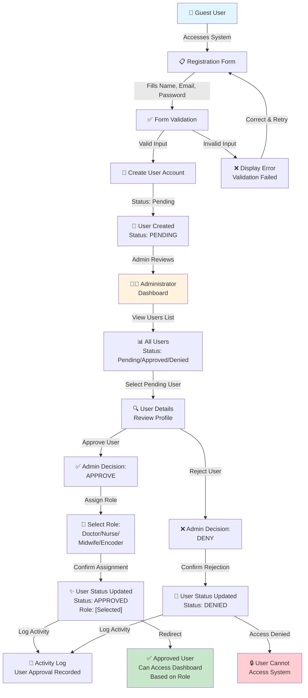
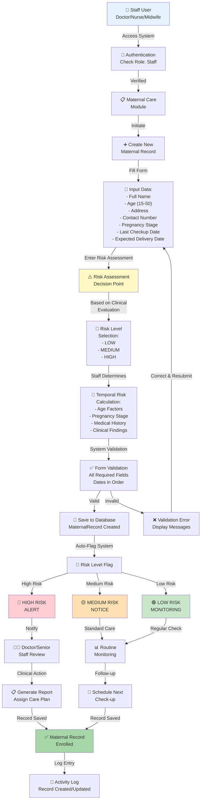

# NutriCare Activity Diagrams

## Introduction

The NutriCare Rural Health Unit (RHU) system is a comprehensive health monitoring platform designed to support maternal and child health initiatives. The system currently has five (5) distinct user roles that interact with the platform in coordinated workflows: **Administrator**, **Doctor**, **Nurse**, **Midwife**, and **Data Encoder**. The following figures illustrate the activity diagrams that demonstrate how these users interact with the system during critical health monitoring functionalities, including user authentication and role-based approval, maternal risk assessment enrollment, and child nutritional tracking with automated status calculations. These workflows ensure that health data is properly validated, systematically processed, and appropriately alerted to responsible personnel for timely clinical intervention.

---

## Activity Diagram 1: User Authentication & Role-Based Approval

This diagram illustrates the complete workflow from user registration through administrative approval and role assignment. The process ensures that only authorized health workers can access the system after verification by the Administrator.

**Flow Description:**
1. **Registration Phase:** Guest users access the registration form and create an account with name, email, and password
2. **Validation Phase:** System validates input data for completeness and uniqueness
3. **Pending Status:** New users are created with "Pending" status awaiting administrative review
4. **Admin Review:** Administrator reviews all pending users in the dashboard
5. **Approval Decision:** Admin can either approve and assign a role, or deny the user
6. **Role Assignment:** Upon approval, a specific role (Doctor, Nurse, Midwife, or Encoder) is assigned
7. **Access Grant/Deny:** Approved users gain system access; denied users cannot access the system
8. **Activity Logging:** All approval/denial actions are recorded in activity logs for audit trails

---

## Activity Diagram 2: Maternal Health Enrollment & Risk Calculation

This diagram demonstrates the maternal health enrollment process where health workers (Doctor, Nurse, or Midwife) input patient data, and the system processes risk assessment information. Health workers manually determine and input risk levels based on clinical assessment.

**Flow Description:**
1. **Staff Access:** Doctor, Nurse, or Midwife logs in and accesses the Maternal Care module
2. **Data Collection:** Staff enters comprehensive patient information including demographics, pregnancy details, and checkup information
3. **Risk Assessment:** Staff performs clinical evaluation and assigns risk level (Low/Medium/High) based on:
   - Maternal age
   - Pregnancy trimester stage
   - Days since last checkup
   - Clinical findings and medical history
4. **Temporal Calculation:** System uses entered dates and pregnancy stage to calculate time-based risk factors
5. **Validation:** System validates all data for completeness and logical consistency
6. **Database Storage:** Valid records are saved to the database
7. **Automatic Flagging:** System automatically categorizes records by risk level
8. **Alert Generation:** High-risk cases trigger clinical alerts for immediate review by senior staff
9. **Care Planning:** Appropriate follow-up and monitoring schedules are generated based on risk level
10. **Audit Trail:** All data entries and updates are logged for compliance and quality assurance

---

## Activity Diagram 3: Child Nutrition Tracking & Automated Status Calculation

This diagram shows the child nutrition monitoring workflow where health staff and data encoders input anthropometric measurements, and the system automatically calculates nutritional status using WHO Z-Score standards, generating alerts as needed.

```mermaid
graph TD
    A["👨‍⚕️ Health Staff/<br/>Data Encoder"] -->|Access System| B["🔐 Authentication<br/>Check Role: Staff/Encoder"]
    B -->|Verified| C["📋 Child Nutrition<br/>Module"]
    C -->|Initiate| D["➕ Create New<br/>Child Record"]
    
    D -->|Fill Form| E["📝 Input Child Data:<br/>- Full Name<br/>- Age (Months: 0-180)<br/>- Barangay<br/>- Weight (kg)<br/>- Height (cm)<br/>- Last Weigh-in Date"]
    
    E -->|Submit Data| F["✅ Form Validation<br/>Check:"]
    F -->|- Date Format<br/>- Numeric Values<br/>- Range Checks| G{Valid?}
    
    G -->|Invalid| H["❌ Validation Error<br/>Display Messages"]
    H -->|Correct & Resubmit| E
    
    G -->|Valid| I["👶 Patient Linking<br/>Check if Patient<br/>Exists"]
    I -->|New Child| J["👨‍👩‍👧 Create Patient<br/>Record<br/>Category: CHILD"]
    I -->|Existing Child| K["🔗 Link to<br/>Existing Patient<br/>Record"]
    
    J -->|Created| L["💾 Save Child<br/>Nutrition Record"]
    K -->|Linked| L
    
    L -->|Trigger Observer| M["⚙️ System Processes<br/>Automatic Calculation"]
    
    M -->|Calculate BMI| N["📐 BMI Formula:<br/>BMI = Weight(kg) /<br/>[Height(m)]²"]
    
    N -->|Get Age Reference| O["📊 WHO Reference<br/>Data by Age:<br/>- Mean BMI<br/>- Std Deviation<br/>for Age Group"]
    
    O -->|Calculate Z-Score| P["🔢 Z-Score Formula:<br/>Z = (BMI - Mean) /<br/>Std Dev"]
    
    P -->|Classify Status| Q["📈 Nutritional Status<br/>Classification:<br/>Decision Point"]
    
    Q -->|Z-Score < -3| R["🔴 SEVERELY<br/>UNDERWEIGHT"]
    Q -->|Z-Score -3 to -2| S["🟡 UNDERWEIGHT"]
    Q -->|Z-Score > -2| T["🟢 NORMAL<br/>NUTRITION"]
    
    R -->|Alert Generated| U["🚨 CRITICAL ALERT<br/>Severe Malnutrition<br/>Immediate Intervention"]
    S -->|Alert Generated| V["⚠️ WARNING ALERT<br/>Nutritional Risk<br/>Monitoring Plan"]
    T -->|Status Recorded| W["✅ NORMAL STATUS<br/>Routine Monitoring"]
    
    U -->|Notify| X["👨‍⚕️ Doctor/Nurse<br/>Review & Plan"]
    V -->|Notify| X
    W -->|Record Status| Y["📋 Display Record<br/>in System"]
    
    X -->|Clinical Action| Z["📅 Schedule<br/>Follow-up Visit<br/>Generate Report"]
    Z -->|Save Result| Y
    
    Y -->|All Data| AA["✅ Child Nutrition<br/>Record Complete:<br/>Status: Stored<br/>Alerts: Generated"]
    
    AA -->|Log Entry| AB["📝 Activity Log<br/>Record Created<br/>Alerts Triggered"]
    
    style A fill:#e0f2f1
    style M fill:#f3e5f5
    style U fill:#ffcdd2
    style V fill:#ffe0b2
    style T fill:#c8e6c9
    style AA fill:#a5d6a7
```

**Flow Description:**
1. **User Access:** Health staff or data encoder logs in and accesses the Child Nutrition module
2. **Data Entry:** Staff inputs child demographic and anthropometric measurements:
   - Full name
   - Age in months (0-180 months / 0-5+ years)
   - Barangay/location
   - Weight in kilograms
   - Height in centimeters
   - Date of last measurement
3. **Input Validation:** System validates all inputs for format, type, and logical range checks
4. **Patient Management:** System automatically:
   - Creates new patient record if child doesn't exist
   - Links nutrition data to existing patient record if found
5. **Automatic Calculation Trigger:** Upon saving, system's Observer pattern automatically initiates calculations
6. **BMI Calculation:** System computes Body Mass Index using standard formula
7. **WHO Reference Data:** System retrieves age-appropriate WHO reference values for BMI standards
8. **Z-Score Calculation:** System calculates Z-Score to compare child's measurements against age-specific standards
9. **Status Classification:** Based on Z-Score thresholds:
   - **Z < -3:** Severely Underweight (Critical - Immediate Action)
   - **Z -3 to -2:** Underweight (Warning - Monitoring Required)
   - **Z > -2:** Normal (Routine Monitoring)
10. **Alert Generation:** System automatically generates appropriate alert levels for clinical attention
11. **Clinical Action:** Medical staff review alerts and create follow-up care plans
12. **Record Storage:** Complete record with calculated status and alerts is stored in database
13. **Audit Trail:** All data entry, calculation, and alert generation is logged for quality assurance

---

## System Integration Notes

- **Swimlanes:** Each diagram clearly separates the User/Staff activities from the System/Backend processes
- **Decision Points:** Diamond-shaped nodes indicate logical decisions and branching workflows
- **Automatic Processes:** Color-coded background elements highlight automated system calculations and alerts
- **Audit Trail:** All major actions are logged by the ActivityLog model for compliance and accountability
- **Role-Based Access:** All workflows are protected by role-based middleware (admin, staff) to ensure appropriate data access
- **Data Validation:** Both client-side and server-side validation ensures data integrity throughout the workflows
- **Notifications:** High-risk and critical alerts are generated automatically to notify relevant medical staff for timely intervention
